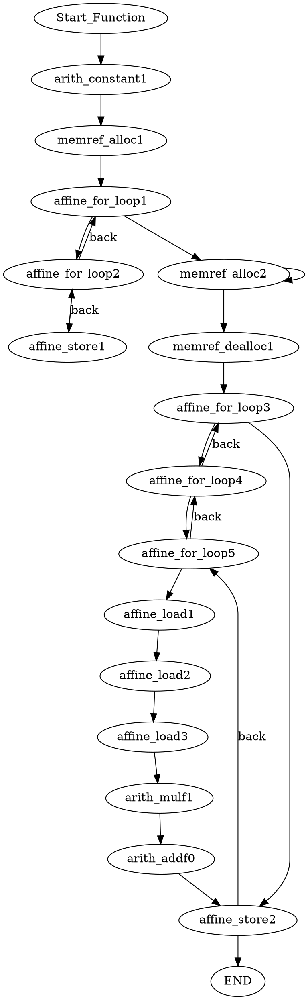

#  Introduction

This repo involves a simple script for conversion of  `torch_mlir`  based affine dialect to `dot`  format graphical visualized  layout

However, only pass matrix-multiplication algorithm as an incubator projects at the beginning. For sake of further extensive and robust use, several sightly modifications  may applied on match  [specific identifiers](https://github.com/anniezfy/Torch_Affine_To_DOT/blob/main/MlirConversionDot/main.cpp#L82C1-L82C12)

For the clear readability，line-by-line comment 

# Per-requisites

1. The source MLIR file has been generated using Torch-MLIR. Make sure to clone the appropriate version of the LLVM project, which is frequently updated.

   You may access right version of MLIR through following path:

   1.1 directly `git clone` from this repo

​	use the following command:

```bash
git clone --recursive  https://github.com/anniezfy/Torch_Affine_To_DOT.git

cd thrid-party;

git submodule init;

git submodule update;

```

​       Now, install LLVM/MLIR according to https://mlir.llvm.org/getting_started/

​     1.2  directly `git clone` from LLVM project, we use the 5341d5465dbf0b35c64c54f200af8389a8b76aef commit

```bash
git clone https://github.com/llvm/llvm-project.git

git checkout 5341d5465dbf0b35c64c54f200af8389a8b76aef 

git clone https://github.com/anniezfy/Torch_Affine_To_DOT.git
```

​    Again  install LLVM/MLIR according to https://mlir.llvm.org/getting_started/

2. Download the corresponding  correct torch and torch_mlir front-end version 

   Following commands contain how to install python3.11 and build an exclusive python virtual environment under Ubuntu 20.04 Linux Operation System

   ```bash
   # Update Ubuntu Before Python 3.11 Installation
   sudo apt update
   sudo apt upgrade
   
   #  Import Python PPA on Ubuntu 22.04 or 20.04
   sudo apt install software-properties-common
   sudo add-apt-repository ppa:deadsnakes/ppa -y
   
   # Run an APT update before proceeding to ensure reflection of the newly imported PPA.
   sudo apt update
   
   # Install Python 3.11 on Ubuntu 22.04 or 20.04
   sudo apt install python3.11
   
   # Verify the installation and build version of Python 3.11
   python3.11 --version
   
   # Install the virtural environment
   sudo apt install python3.11-venv
   
   python3.11 -m venv myvenv
   
   #Activate the virtual environment 
   source myvenv/bin/activate
   
   ```
   
   ##    

3. We use the specific 20231019.996  torch-mlir and mlir package version

   Downlink link: `https://github.com/llvm/torch-mlir/releases/tag/snapshot-20231019.996`

```bash
# download the correspoding version depending on your computer architecter and system  
 wget https://github.com/llvm/torch-mlir/releases/download/snapshot-20231019.996/torch-2.2.0.dev20231006+cpu-cp311-cp311-linux_x86_64.whl

wget https://github.com/llvm/torch-mlir/releases/download/snapshot-20231019.996/torch_mlir-20231019.996-cp311-cp311-linux_x86_64.whl

# install the packages
pip3.11 install torch-2.2.0.dev20231006+cpu-cp311-cp311-linux_x86_64.whl
pip3.11 install torch_mlir-20231019.996-cp311-cp311-linux_x86_64.whl
```


# Dot format file illustration

[Dot](https://graphviz.org/doc/info/lang.html) is known as a graph representation  language for  a clear and hierarchical  program flow structure description.

Besides, the Dot language provides syntax for defining (named and anonymous) graphs, nodes and edges, plus the ability to attach string-valued name-attribute pairs to graph components

For example:  two pairs of string-valued name-attribute are attached to node `a`

```
`digraph G {`
    `a [label="start", color="red"];`
    `b [label="end", color="green"];`
    `a -> b [label="path", style="dashed"];`
`}`
```

Dot is a language for describing the structure of graph of which could be rendered and visualized via Graphviz Tool and end 	up with generating a diagram

​           [Graphivz Online  Link](https://dreampuf.github.io/GraphvizOnline/#graph%20ER%20%7B%20node%20%5Bshape%3Dbox%5D%3B%20course%3B%20institute%3B%20student%3B%20node%20%5Bshape%3Dellipse%5D%3B%20%7Bnode%20%5Blabel%3D%22name%22%5D%20name0%3B%20name1%3B%20name2%3B%7D%20code%3B%20grade%3B%20number%3B%20node%20%5Bshape%3Ddiamond%2Cstyle%3Dfilled%2Ccolor%3Dlightgrey%5D%3B%20%22C-I%22%3B%20%22S-C%22%3B%20%22S-I%22%3B%20name0%20--%20course%3B%20code%20--%20course%3B%20course%20--%20%22C-I%22%20%5Blabel%3D%22n%22%2Clen%3D1.00%5D%3B%20%22C-I%22%20--%20institute%20%5Blabel%3D%221%22%2Clen%3D1.00%5D%3B%20institute%20--%20name1%3B%20institute%20--%20%22S-I%22%20%5Blabel%3D%221%22%2Clen%3D1.00%5D%3B%20%22S-I%22%20--%20student%20%5Blabel%3D%22n%22%2Clen%3D1.00%5D%3B%20student%20--%20grade%3B%20student%20--%20name2%3B%20student%20--%20number%3B%20student%20--%20%22S-C%22%20%5Blabel%3D%22m%22%2Clen%3D1.00%5D%3B%20%22S-C%22%20--%20course%20%5Blabel%3D%22n%22%2Clen%3D1.00%5D%3B%20fontsize%3D20%3B%20label%20%3D%20%22%5Cn%5CnEntity%20Relation%20Diagram%5Cndrawn%20by%20NEATO%22%3B%20%7D)


# Case example 

## GEMM

1.1 Pipeline Stage One 

​     Run a simple example GEMM script under  following directory  `Torch_MLIR_MATRIX/main.py`

```python
class MatMulModule(torch.nn.Module):
    def forward(self, a, b):
        return torch.matmul(a, b)

# 创建两个 3x3 的矩阵作为输入
input_a = torch.ones(3, 3)
input_b = torch.ones(3, 3) * 2
```

The above script emit Intermediate representation(IR)  base on `linalg` dialect, further transformation such as one-shot-bufferization and affine are required

```bash
mlir-opt compiled_torch2.2.mlir --canonicalize -convert-tensor-to-linalg -empty-tensor-to-alloc-tensor \
-eliminate-empty-tensors -linalg-bufferize -arith-bufferize   -tensor-bufferize -func-bufferize \
-finalizing-bufferize -buffer-deallocation   --buffer-results-to-out-params   --canonicalize -cse \
-convert-linalg-to-affine-loops > matrix_mulitiplication_2.2.mlir
```


1.2 Pipeline Stage Two

input `Stage one generated ` mlir code  snippet 


```mlir
module attributes {torch.debug_module_name = "MatMulModule"} {
  ml_program.global private mutable @global_seed(dense<0> : tensor<i64>) : tensor<i64>
  func.func @forward(%arg0: memref<3x3xf32>, %arg1: memref<3x3xf32>, %arg2: memref<3x3xf32>) {
    %cst = arith.constant 0.000000e+00 : f32
    %alloc = memref.alloc() {alignment = 64 : i64} : memref<3x3xf32>
    affine.for %arg3 = 0 to 3 {
      affine.for %arg4 = 0 to 3 {
        affine.store %cst, %alloc[%arg3, %arg4] : memref<3x3xf32>
      }
    }
    %alloc_0 = memref.alloc() {alignment = 64 : i64} : memref<3x3xf32>
    memref.copy %alloc, %alloc_0 : memref<3x3xf32> to memref<3x3xf32>
    memref.dealloc %alloc : memref<3x3xf32>
    affine.for %arg3 = 0 to 3 {
      affine.for %arg4 = 0 to 3 {
        affine.for %arg5 = 0 to 3 {
          %0 = affine.load %arg0[%arg3, %arg5] : memref<3x3xf32>
          %1 = affine.load %arg1[%arg5, %arg4] : memref<3x3xf32>
          %2 = affine.load %alloc_0[%arg3, %arg4] : memref<3x3xf32>
          %3 = arith.mulf %0, %1 : f32
          %4 = arith.addf %2, %3 : f32
          affine.store %4, %alloc_0[%arg3, %arg4] : memref<3x3xf32>
        }
      }
    }
    memref.copy %allo`c_0, %arg2 : memref<3x3xf32> to memref<3x3xf32>
    return
  }
}
```

emit output dot format file





visualized graph layout

 

## FFT

1.In FFT example we only  consider about computation stages and set all coefficients in default at initialization stage

Here is code snippet 

```cpp
#include "FFT.h"
#include<cmath>


const int NUM = 4;
const int SIZE = NUM*(NUM+1)/2;


int mypow(int a,int b){
    int res=1;
    for(int i=0;i<b;i++){
        res*=a;
    }
    return res;
}

struct MyComplex {
    double real;
    double imag;
    

};

struct MyComplex add(struct MyComplex a,struct MyComplex b){
    struct MyComplex c={};
    c.real=a.real+b.real;
    c.imag=a.imag+b.imag;
    return c;
}
struct MyComplex sub(struct MyComplex a,struct MyComplex b){
    struct MyComplex c={};
    c.real=a.real-b.real;
    c.imag=a.imag-b.imag;
    return c;
}
struct MyComplex mul(struct MyComplex a,struct MyComplex b){
    struct MyComplex c={};
    c.real=a.real*b.real+(a.imag*b.imag)*(-1);
    c.imag=a.real*b.imag+a.imag*b.real;
    return c;
}

void f_func(struct MyComplex fft[1024],int i,int j,struct MyComplex w){
    struct MyComplex t,temp=add(fft[i], mul(w,fft[j]) );
    t.real=fft[i].real;
    t.imag=fft[i].imag;
    fft[i].real=temp.real;
    fft[i].imag=temp.imag;
    struct MyComplex temp1=sub(t, mul(w,fft[j]) );
    fft[j].real=temp1.real;
    fft[j].imag=temp1.imag;
}
struct MyComplex w_func(int m,int N){
    struct MyComplex c={0,0};
    c.real=cos(2*acos(-1)*m/N);
    c.imag=sin(-2*acos(-1)*m/N);
    return c;
}
int reverse(int n,int l){
    int i=0,r=0,t;
    while(i<l){
        t=n&1;
        n=n>>1;
        r+=t*mypow(2,l-1-i);
        i++;
    }
    return r;
}
struct MyComplex[] FFT(struct MyComplex A[1024];){
    for(int k=1;k<=32;k++){
    //int tempPr1=1024/mypow(2,k);
        for(int l=0;l<1024/(k*k);l++){
        //int tempPr2=mypow(2,k-1);
            for(int i=0;i<(k-1)*(k-1);i++){
                    f_func(A,l*k*k+i,l*k*k+i+(k-1)*(k-1),w_func(i,(k*k)));
            }
        }
    }
    return A;
}


```

2. After a serial of process, here is the visualized graph layout

   

   
