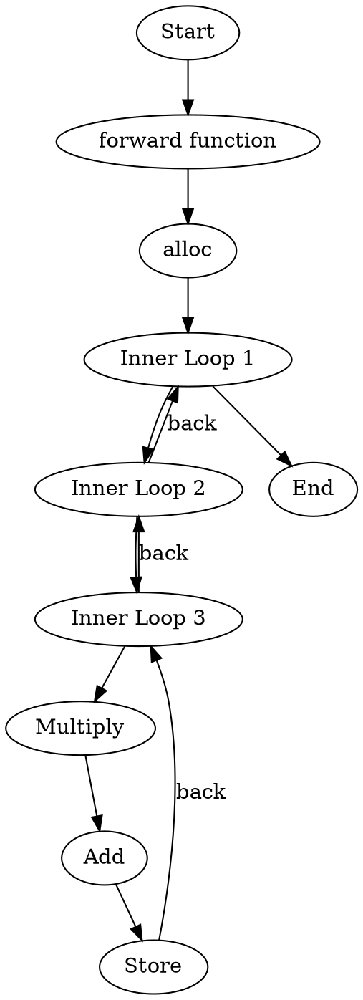

#  Introduction

This repo involves a simple script for conversion of  `torch_mlir`  based affine dialect to `dot`  format graphical visualized  layout

However, only pass matrix-multiplication algorithm as an incubator projects at the beginning. For sake of further extensive and robust use, several sightly modifications  may applied on match  [specific identifiers](https://github.com/anniezfy/Torch_Affine_To_DOT/blob/main/MlirConversionDot/main.cpp#L82C1-L82C12)

For the clear readability，line-by-line comment 

# Per-requisites

1. The source MLIR file has been generated using Torch-MLIR. Make sure to clone the appropriate version of the LLVM project, which is frequently updated.

   You may access right version of MLIR through following path:

   1.1 directly `git clone` from this repo

​	use the following command:

```bash
git clone --recursive  https://github.com/anniezfy/Torch_Affine_To_DOT.git

cd thrid-party;

git submodule init;

git submodule update;

```

​       Now, install LLVM/MLIR according to https://mlir.llvm.org/getting_started/

​     1.2  directly `git clone` from LLVM project, we use the 5341d5465dbf0b35c64c54f200af8389a8b76aef commit

```bash
git clone https://github.com/llvm/llvm-project.git

git checkout 5341d5465dbf0b35c64c54f200af8389a8b76aef 

git clone https://github.com/anniezfy/Torch_Affine_To_DOT.git
```

​    Again  install LLVM/MLIR according to https://mlir.llvm.org/getting_started/

2. Download the corresponding torch/torch front-ends

   Torch version: torch-2.1.0-cp311

   Torchmlir version: torch_mlir-20231019.996-cp311

​       Download link: https://github.com/llvm/torch-mlir/releases/tag/snapshot-20231019.996

```bash
python3 -m venv myenv

source myenv/bin/activate

wget https://github.com/llvm/torch-mlir/releases/tag/snapshot-20231019.996/torch-2.2.0.dev20231006+cpu-cp38-cp38-linux_x86_64.whl


wget https://github.com/llvm/torch-mlir/releases/tag/snapshot-20231019.996/torch_mlir-20231019.996-cp311-cp311-linux_x86_64.whl

pip3.11 torch-2.2.0.dev20231006+cpu-cp38-cp38-linux_x86_64.whl

pip3.11 torch_mlir-20231019.996-cp311-cp311-linux_x86_64.whl
```
# Dot format file illustration

[Dot](https://graphviz.org/doc/info/lang.html) is known as a graph representation  language for  a clear and hierarchical  program flow structure description.

Besides, the Dot language provides syntax for defining (named and anonymous) graphs, nodes and edges, plus the ability to attach string-valued name-attribute pairs to graph components

For example:  two pairs of string-valued name-attribute are attached to node `a`

```
`digraph G {`
    `a [label="start", color="red"];`
    `b [label="end", color="green"];`
    `a -> b [label="path", style="dashed"];`
`}`
```

Dot is a language for describing the structure of graph of which could be rendered and visualized via Graphviz Tool and end 	up with generating a diagram

​           [Graphivz Online  Link](https://dreampuf.github.io/GraphvizOnline/#graph%20ER%20%7B%20node%20%5Bshape%3Dbox%5D%3B%20course%3B%20institute%3B%20student%3B%20node%20%5Bshape%3Dellipse%5D%3B%20%7Bnode%20%5Blabel%3D%22name%22%5D%20name0%3B%20name1%3B%20name2%3B%7D%20code%3B%20grade%3B%20number%3B%20node%20%5Bshape%3Ddiamond%2Cstyle%3Dfilled%2Ccolor%3Dlightgrey%5D%3B%20%22C-I%22%3B%20%22S-C%22%3B%20%22S-I%22%3B%20name0%20--%20course%3B%20code%20--%20course%3B%20course%20--%20%22C-I%22%20%5Blabel%3D%22n%22%2Clen%3D1.00%5D%3B%20%22C-I%22%20--%20institute%20%5Blabel%3D%221%22%2Clen%3D1.00%5D%3B%20institute%20--%20name1%3B%20institute%20--%20%22S-I%22%20%5Blabel%3D%221%22%2Clen%3D1.00%5D%3B%20%22S-I%22%20--%20student%20%5Blabel%3D%22n%22%2Clen%3D1.00%5D%3B%20student%20--%20grade%3B%20student%20--%20name2%3B%20student%20--%20number%3B%20student%20--%20%22S-C%22%20%5Blabel%3D%22m%22%2Clen%3D1.00%5D%3B%20%22S-C%22%20--%20course%20%5Blabel%3D%22n%22%2Clen%3D1.00%5D%3B%20fontsize%3D20%3B%20label%20%3D%20%22%5Cn%5CnEntity%20Relation%20Diagram%5Cndrawn%20by%20NEATO%22%3B%20%7D)


# Case example 
input code mlir snippet 


```mlir
module attributes {torch.debug_module_name = "MatMulModule"} {
  ml_program.global private mutable @global_seed(dense<0> : tensor<i64>) : tensor<i64>
  func.func @forward(%arg0: memref<3x3xf32>, %arg1: memref<3x3xf32>, %arg2: memref<3x3xf32>) {
    %cst = arith.constant 0.000000e+00 : f32
    %alloc = memref.alloc() {alignment = 64 : i64} : memref<3x3xf32>
    affine.for %arg3 = 0 to 3 {
      affine.for %arg4 = 0 to 3 {
        affine.store %cst, %alloc[%arg3, %arg4] : memref<3x3xf32>
      }
    }
    %alloc_0 = memref.alloc() {alignment = 64 : i64} : memref<3x3xf32>
    memref.copy %alloc, %alloc_0 : memref<3x3xf32> to memref<3x3xf32>
    memref.dealloc %alloc : memref<3x3xf32>
    affine.for %arg3 = 0 to 3 {
      affine.for %arg4 = 0 to 3 {
        affine.for %arg5 = 0 to 3 {
          %0 = affine.load %arg0[%arg3, %arg5] : memref<3x3xf32>
          %1 = affine.load %arg1[%arg5, %arg4] : memref<3x3xf32>
          %2 = affine.load %alloc_0[%arg3, %arg4] : memref<3x3xf32>
          %3 = arith.mulf %0, %1 : f32
          %4 = arith.addf %2, %3 : f32
          affine.store %4, %alloc_0[%arg3, %arg4] : memref<3x3xf32>
        }
      }
    }
    memref.copy %allo`c_0, %arg2 : memref<3x3xf32> to memref<3x3xf32>
    return
  }
}
```

Generated output dot format file



visualize graph layout

 


